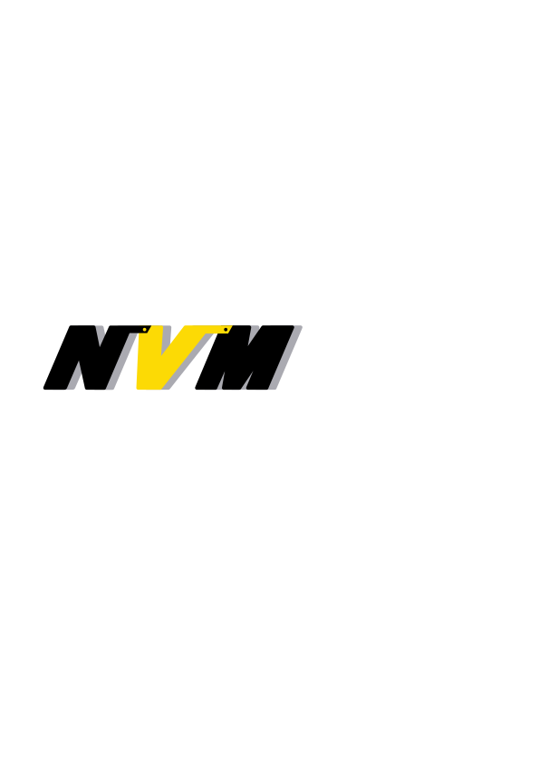

# NVM – Sitio Web Corporativo

Sitio web corporativo desarrollado para **NVM**, orientado a la presentación de la empresa, su portafolio de productos y el contacto comercial.

El proyecto fue construido como un sitio estático moderno, priorizando rendimiento, claridad de navegación y buenas prácticas de SEO técnico.

---

## Descripción del proyecto

Este sitio web funciona como la presencia digital principal de NVM.  
Incluye:

- Página principal (landing)
- Portafolio de familias de productos
- Páginas individuales por familia
- Información técnica y comercial organizada
- Accesos directos a contacto

La arquitectura permite que el contenido se mantenga ordenado y escalable sin complejidad innecesaria.

---

## Tecnologías utilizadas

- **Astro** – Generador de sitios estáticos
- **Tailwind CSS** – Sistema de estilos
- **Markdown** – Gestión de contenido
- **Astro Content Collections** – Organización y validación del contenido
- **Astro Assets** – Optimización de imágenes
- **Netlify** – Despliegue y hosting

---

## Estructura general

src/
├─ components/ Componentes reutilizables
├─ layouts/ Layout base del sitio
├─ pages/ Páginas del sitio
├─ content/
│ └─ familias/ Contenido de familias de productos (Markdown)
├─ assets/ Imágenes optimizadas
├─ scripts/ Scripts de interacción
└─ styles/ Estilos globales

## Despliegue

El sitio se encuentra desplegado mediante **Netlify**, con integración continua desde el repositorio.

Cada actualización en la rama principal genera automáticamente una nueva versión del sitio.

---

## Dominio y acceso

El dominio del proyecto se encuentra configurado para apuntar al despliegue en Netlify, incluyendo certificado SSL y acceso seguro mediante HTTPS.

---

## Autoría

Desarrollado por **Daniel Sebastian Vargas Gutierrez - danielsvg27@gmail.com**  
Ingeniero de Sistemas  
